# 🇮🇳 BhoomiTrack / NLAMS — Frontend API Integration Guide

Welcome to the **National Land Acquisition & Management System (NLAMS) / BhoomiTrack** API Documentation. This guide is crafted specifically for frontend developers (React, Next.js, Vue, Angular, or Mobile) to integrate seamlessly with the backend.

---

## ⚡ 1. Base URL & Environments

| Environment | Base URL | Notes |
| :--- | :--- | :--- |
| **Local Development** | `http://localhost:8080` | Local backend instance |
| **Docker Compose** | `http://localhost:8080` | Containerized setup |
| **Cloud (Render)** | `https://<your-render-app>.onrender.com` | Deployed backend |

- **Interactive Swagger UI**: [`http://localhost:8080/swagger-ui.html`](http://localhost:8080/swagger-ui.html)
- **Raw OpenAPI 3.0 JSON Spec**: [`http://localhost:8080/v3/api-docs`](http://localhost:8080/v3/api-docs)
- **Health & Readiness Check**: [`http://localhost:8080/health`](http://localhost:8080/health) or [`http://localhost:8080/api/health`](http://localhost:8080/api/health)
- **Spring Actuator Probe**: [`http://localhost:8080/actuator/health`](http://localhost:8080/actuator/health)

---

### 🩺 Health Check Response Format (`GET /health` or `GET /api/health`)
Checks PostgreSQL connection, PostGIS spatial extension, JVM memory allocation, and system uptime:
```json
{
  "status": "UP",
  "application": "National Land Acquisition & Management System (BhoomiTrack)",
  "timestamp": "2026-10-03T13:35:00Z",
  "uptimeSeconds": 1420,
  "uptimeFormatted": "0d 00h 23m 40s",
  "activeProfiles": ["postgres"],
  "components": {
    "database": {
      "status": "UP",
      "databaseProduct": "PostgreSQL",
      "databaseVersion": "16.3",
      "postgis": "ENABLED"
    },
    "jvmMemory": {
      "status": "UP",
      "usedMb": 182,
      "freeMb": 146,
      "totalAllocatedMb": 328,
      "maxAvailableMb": 512
    },
    "diskSpace": {
      "status": "UP",
      "freeMb": 48210,
      "totalMb": 102400
    }
  }
}
```

## 📦 2. Standard Response Wrapper

All API responses (except file downloads) follow a unified JSON envelope:

### ✅ Success Response Format
```json
{
  "success": true,
  "message": "Operation completed successfully",
  "data": { ... },
  "timestamp": "2026-10-02T23:18:00"
}
```

### 📄 Paginated Response Format (`Page<T>`)
Endpoints that return lists support pagination via query parameters: `?page=0&size=10&sort=createdAt,desc`.
```json
{
  "success": true,
  "message": "OK",
  "data": {
    "content": [ ... ],
    "page": {
      "size": 10,
      "number": 0,
      "totalElements": 42,
      "totalPages": 5
    }
  },
  "timestamp": "2026-10-02T23:18:00"
}
```

### ❌ Error Response Format
```json
{
  "success": false,
  "message": "Project with code 'PRJ-2026-001' already exists",
  "status": 409,
  "timestamp": "2026-10-02T23:18:00",
  "validationErrors": {
    "landRequired": "Land requirement must be greater than zero"
  }
}
```

---

## 🏛️ 3. Core Acquisition Workflow (How the Pieces Connect)

```mermaid
flowchart LR
    A[1. Project] --> B[2. Proposal Draft]
    B --> C[3. District/State Approval]
    C --> D[4. Land Parcels Cadastral Survey]
    D --> E[5. Field Verification]
    E --> F[6. Section 11 Preliminary Gazette]
    F --> G[7. Section 19 Final Gazette]
    G --> H[8. Section 23 Award + 100% Solatium]
    H --> I[9. Treasury Approval & RTGS Payment]
    I --> J[10. Physical Possession Panchnama]
    J --> K[11. R&R Entitlements Allotted]
    K --> L[12. Acquisition Completed]
```



---

## 📋 4. Complete REST Endpoints by Module

---

### Module 1: Projects (`/api/projects`)

#### 1.1 List Projects (with Filters & Pagination)
- **Method**: `GET /api/projects`
- **Query Params**:
  - `state` *(optional)*: e.g. `Gujarat`
  - `district` *(optional)*: e.g. `Surat`
  - `status` *(optional)*: `DRAFT | PROPOSAL_SUBMITTED | IN_PROGRESS | COMPLETED | CANCELLED`
  - `projectType` *(optional)*: `HIGHWAY | RAILWAY | METRO | AIRPORT | PORT | INDUSTRIAL_CORRIDOR | SMART_CITY | RENEWABLE_ENERGY | IRRIGATION | DEFENSE | OTHER`
  - `page` *(default: 0)*, `size` *(default: 10)*, `sort` *(default: createdAt,desc)*
- **Response `data`**: `Page<ProjectResponse>`

#### 1.2 Create Project
- **Method**: `POST /api/projects`
- **Request Body**:
```json
{
  "projectCode": "PRJ-WFC-2026",
  "projectName": "Western Dedicated Freight Corridor - Surat Section",
  "projectType": "RAILWAY",
  "description": "High-speed freight railway corridor linking Hazira Port",
  "implementingAgency": "DFCCIL",
  "ministryDepartment": "Ministry of Railways",
  "state": "Gujarat",
  "district": "Surat",
  "estimatedLandRequirement": 150.0,
  "requiredLandUnit": "ACRES",
  "projectStartDate": "2026-01-01",
  "expectedCompletionDate": "2028-12-31",
  "status": "DRAFT"
}
```

#### 1.3 Get Project by ID
- **Method**: `GET /api/projects/{id}`

#### 1.4 Update Project Details
- **Method**: `PUT /api/projects/{id}`

#### 1.5 Update Project Status
- **Method**: `PATCH /api/projects/{id}/status`
- **Request Body**:
```json
{
  "status": "IN_PROGRESS",
  "remarks": "Moving to in-progress field verification"
}
```

---

### Module 2: Proposals (`/api/proposals`)

#### 2.1 List Proposals
- **Method**: `GET /api/proposals`
- **Query Params**: `projectId`, `status`, `district`, `state`, `page`, `size`

#### 2.2 Create Proposal Draft
- **Method**: `POST /api/proposals`
- **Request Body**:
```json
{
  "projectId": 1,
  "proposalNumber": "PROP-2026-001",
  "landRequired": 50.0,
  "landUnit": "ACRES",
  "villages": "Bhestan, Pandesara, Udhna",
  "district": "Surat",
  "state": "Gujarat",
  "purpose": "Track doubling and freight yard terminal",
  "proposedTimelineMonths": 18,
  "affectedFamiliesCount": 24,
  "estimatedCompensation": 185000000.0,
  "remarks": "Urgent acquisition proposal for statutory clearance"
}
```

#### 2.3 Submit Proposal for Approval
- **Method**: `POST /api/proposals/{id}/submit`
- Transitions status from `DRAFT` / `RETURNED` -> `SUBMITTED`.

#### 2.4 Multi-Tier Approval (District / State Authority)
- **Method**: `POST /api/proposals/{id}/approve`
- **Request Body**:
```json
{
  "decision": "APPROVED",
  "remarks": "Verified and approved by District Collector Committee",
  "approvedBy": "District Collector Surat",
  "approvalLevel": "DISTRICT"
}
```

#### 2.5 Return Proposal for Corrections
- **Method**: `POST /api/proposals/{id}/return`

#### 2.6 Reject Proposal
- **Method**: `POST /api/proposals/{id}/reject`

#### 2.7 View Proposal Approval Audit History
- **Method**: `GET /api/proposals/{id}/history`

---

### Module 3: Land Parcels (`/api/land-parcels`)

#### 3.1 List Parcels
- **Method**: `GET /api/land-parcels`
- **Query Params**: `projectId`, `district`, `status`, `village`, `page`, `size`

#### 3.2 Register Cadastral Parcel
- **Method**: `POST /api/land-parcels`
- **Request Body**:
```json
{
  "projectId": 1,
  "parcelNumber": "P-SRT-0102",
  "surveyNumber": "102/1A",
  "khasraNumber": "KH-102",
  "village": "Bhestan",
  "tehsil": "Choryasi",
  "district": "Surat",
  "state": "Gujarat",
  "area": 3.5,
  "areaUnit": "ACRES",
  "landType": "PRIVATE",
  "ownerName": "Ramesh Bhai Patel",
  "ownerContact": "+919876543210",
  "ownerAadhaarMasked": "XXXXXXXX1234",
  "latitude": 21.1702,
  "longitude": 72.8311,
  "remarks": "Cadastral field survey completed"
}
```

#### 3.3 Field Verification by Officer
- **Method**: `PATCH /api/land-parcels/{id}/verify`
- **Request Body**:
```json
{
  "verificationStatus": "VERIFIED",
  "verifiedBy": "Revenue Inspector - Choryasi",
  "remarks": "On-site physical boundaries and khasra verified"
}
```

#### 3.4 Update Parcel Acquisition Status
- **Method**: `PATCH /api/land-parcels/{id}/status`
- **Request Body**:
```json
{
  "status": "SECTION_11_NOTIFIED",
  "remarks": "Preliminary notification published"
}
```
*Statuses*: `IDENTIFIED | FIELD_VERIFIED | SECTION_11_NOTIFIED | SECTION_19_DECLARED | AWARD_DECLARED | COMPENSATION_PAID | POSSESSION_TAKEN | ACQUIRED | DISPUTED`

---

### Module 4: GIS & Mapbox/Leaflet Integration (`/api/gis`)

#### 4.1 Project Parcels GeoJSON FeatureCollection
- **Method**: `GET /api/gis/projects/{projectId}/parcels`
- **Response**: Standard RFC 7946 GeoJSON `FeatureCollection` ready for `map.addSource('parcels', { type: 'geojson', data })`:
```json
{
  "type": "FeatureCollection",
  "features": [
    {
      "type": "Feature",
      "id": 1,
      "geometry": {
        "type": "Polygon",
        "coordinates": [[[72.83, 21.17], [72.84, 21.17], [72.84, 21.18], [72.83, 21.18], [72.83, 21.17]]]
      },
      "properties": {
        "parcelId": 1,
        "parcelNumber": "P-SRT-0102",
        "surveyNumber": "102/1A",
        "ownerName": "Ramesh Bhai Patel",
        "area": 3.5,
        "status": "SECTION_11_NOTIFIED",
        "color": "#F59E0B"
      }
    }
  ]
}
```

#### 4.2 Project GIS Acquisition Summary
- **Method**: `GET /api/gis/projects/{projectId}/summary`
- Returns: `totalArea`, `acquiredArea`, `pendingArea`, `acquisitionPercentage`, and polygon bounds.

#### 4.3 District Parcels GeoJSON
- **Method**: `GET /api/gis/parcels/district?district=Surat`

#### 4.4 Spatial Radius Query
- **Method**: `GET /api/gis/parcels/nearby?lat=21.17&lng=72.83&radiusKm=10`

---

### Module 5: Statutory Gazette Notifications (`/api/notifications`)

#### 5.1 Publish Gazette Notification (Sec 11 / Sec 19)
- **Method**: `POST /api/notifications`
- **Request Body**:
```json
{
  "projectId": 1,
  "notificationType": "SECTION_11_PRELIMINARY",
  "notificationNumber": "SEC11-GZ-2026-089",
  "issueDate": "2026-03-01",
  "publicationDate": "2026-03-05",
  "gazetteNumber": "GZ/GUJ/2026/044",
  "description": "Preliminary notification for acquisition in Surat district",
  "remarks": "Published in official state gazette and two regional newspapers"
}
```
*Notification Types*: `SECTION_11_PRELIMINARY | SECTION_19_FINAL_DECLARATION | SECTION_21_PUBLIC_NOTICE | SECTION_40_URGENCY_CLAUSE`

#### 5.2 List Notifications
- **Method**: `GET /api/notifications`
- **Query Params**: `projectId`, `type`, `status`, `page`, `size`

---

### Module 6: Statutory Awards & 100% Solatium (`/api/awards`)

#### 6.1 Declare Statutory Award (Sec 23)
- **Method**: `POST /api/awards`
- **Request Body**:
```json
{
  "projectId": 1,
  "parcelId": 1,
  "awardNumber": "AWD-SURAT-2026-012",
  "awardDate": "2026-05-15",
  "assessedAmount": 15000000.0,
  "marketValue": 7500000.0,
  "solatium": 7500000.0,
  "additionalAmount": 0.0,
  "competentAuthority": "Competent Authority & District Land Acquisition Officer",
  "remarks": "Calculated with statutory 100% Solatium under RFCTLARR Act 2013"
}
```

#### 6.2 List Awards
- **Method**: `GET /api/awards`

---

### Module 7: Compensation & Bank Disbursement (`/api/compensation`)

#### 7.1 Create Compensation Assessment
- **Method**: `POST /api/compensation`
- **Request Body**:
```json
{
  "projectId": 1,
  "parcelId": 1,
  "beneficiaryName": "Ramesh Bhai Patel",
  "beneficiaryType": "TITLE_HOLDER",
  "bankAccountNumberMasked": "XXXXXXXX9876",
  "ifscCode": "SBIN0001234",
  "assessedAmount": 15000000.0,
  "approvedAmount": 15000000.0,
  "remarks": "Approved by District Treasury for RTGS disbursement"
}
```

#### 7.2 Treasury Approval
- **Method**: `POST /api/compensation/{id}/approve`

#### 7.3 Mark Paid with RTGS/PFMS Transaction Reference
- **Method**: `POST /api/compensation/{id}/mark-paid`
- **Request Body**:
```json
{
  "paidAmount": 15000000.0,
  "paymentDate": "2026-06-01",
  "transactionReference": "UTR-RTGS-9823471029",
  "paymentMode": "RTGS",
  "remarks": "Direct bank credit transferred via PFMS"
}
```

---

### Module 8: Physical Possession (`/api/possession`)

#### 8.1 Schedule Possession Handover
- **Method**: `POST /api/possession`
- **Request Body**:
```json
{
  "projectId": 1,
  "parcelId": 1,
  "possessionDate": "2026-06-15",
  "possessionOfficer": "Tehsildar Choryasi",
  "inspectionReference": "INSP-SURAT-99",
  "remarks": "Scheduled physical handover"
}
```

#### 8.2 Mark Possession Taken (Panchnama)
- **Method**: `PATCH /api/possession/{id}/status`
- **Request Body**:
```json
{
  "status": "POSSESSION_TAKEN",
  "possessionDate": "2026-06-20",
  "remarks": "Panchnama executed in presence of 5 village witnesses"
}
```

---

### Module 9: Rehabilitation & Resettlement (R&R) (`/api/rr/families`)

#### 9.1 Register Affected/Displaced Family
- **Method**: `POST /api/rr/families`
- **Request Body**:
```json
{
  "projectId": 1,
  "familyHeadName": "Ramesh Bhai Patel",
  "familyMemberCount": 5,
  "category": "DISPLACED",
  "socialCategory": "GENERAL",
  "village": "Bhestan",
  "district": "Surat",
  "state": "Gujarat",
  "entitlementDetails": "Resettlement Plot #12 + INR 5,00,000 grant",
  "assistanceAmount": 500000.0,
  "alternativeSiteAllotted": true,
  "alternativeSiteDetails": "Sector 4 Resettlement Colony",
  "remarks": "R&R package approved by Rehabilitation Officer"
}
```

#### 9.2 Update Family R&R Status
- **Method**: `PATCH /api/rr/families/{id}/status`
- **Request Body**:
```json
{
  "status": "COMPLETED",
  "assistanceProvided": 500000.0,
  "remarks": "Grant disbursed and plot keys handed over"
}
```

---

### Module 10: Lifecycle Milestones & Automated Delay Pipeline

#### 10.1 Initialize Standard 9-Stage Acquisition Pipeline
- **Method**: `POST /api/projects/{projectId}/milestones/initialize-lifecycle`
- Automatically generates all 9 statutory stages with target dates and delay monitoring.

#### 10.2 Get Timeline & Delays
- **Method**: `GET /api/projects/{projectId}/milestones`
- Each milestone includes: `plannedStartDate`, `plannedCompletionDate`, `actualCompletionDate`, `delayDays`, and `status`.

---

### Module 11: Executive Dashboards (`/api/dashboard`)

| Endpoint | Description |
| :--- | :--- |
| `GET /api/dashboard/national` | Country-level KPIs: Total projects, hectares, budget, compensation paid, delays |
| `GET /api/dashboard/project/{id}` | Project progress: % land acquired, % compensation paid, % possession, milestone timeline |
| `GET /api/dashboard/state/{stateName}` | State-level progress summary & aggregated district stats |
| `GET /api/dashboard/district/{districtName}` | District Magistrate level view of projects, parcels, and disbursements |

---

### Module 12: Statutory & Bottleneck Reports (`/api/reports`)

| Endpoint | Returns |
| :--- | :--- |
| `GET /api/reports/state-wise` | State-by-state progress, land acquired, and expenditure |
| `GET /api/reports/district-wise` | District-by-district performance metrics |
| `GET /api/reports/project-wise` | Detailed project progress, financial outlay, and milestone delays |
| `GET /api/reports/compensation` | Audit list of all compensation assessments, RTGS payments & UTRs |
| `GET /api/reports/possession` | All physical possession logs and panchnama records |
| `GET /api/reports/rr` | Entitlement and resettlement status for affected families |
| `GET /api/reports/delays` | **Critical**: Projects and milestones that have exceeded statutory timelines |

---

### Module 13: Documents (`/api/documents`)

#### 13.1 Multipart File Upload
- **Method**: `POST /api/documents/upload`
- **Content-Type**: `multipart/form-data`
- **Form Data**:
  - `file`: `File` (PDF, PNG, JPG, etc., up to 50MB)
  - `documentType`: `SECTION_11_GAZETTE | SECTION_19_GAZETTE | PANCHNAMA | VALUATION_REPORT | COURT_ORDER | NOC | OTHER`
  - `entityType`: `PROJECT | PROPOSAL | LAND_PARCEL | NOTIFICATION | AWARD | COMPENSATION | POSSESSION | RR_FAMILY`
  - `entityId`: `number` (ID of the entity)
  - `description` *(optional)*: `string`
  - `uploadedBy` *(optional)*: `string`

#### 13.2 Download File
- **Method**: `GET /api/documents/{id}/download` (returns binary stream)

#### 13.3 Get Documents by Entity
- **Method**: `GET /api/documents/entity/{entityType}/{entityId}`

---

### Module 14: Audit Trail (`/api/audit`)

- `GET /api/audit`: Paginated system-wide audit trail.
- `GET /api/audit/{entityName}/{entityId}`: Complete chronological state transition history for any entity.

---

## 💻 5. Ready-to-use TypeScript Types (`types/api.ts`)

Frontend developers can copy and paste this directly into their project:

```typescript
// ==================== COMMON ====================
export interface ApiResponse<T> {
  success: boolean;
  message: string;
  data: T;
  timestamp: string;
}

export interface PageResponse<T> {
  content: T[];
  page: {
    size: number;
    number: number;
    totalElements: number;
    totalPages: number;
  };
}

// ==================== ENUMS ====================
export type ProjectType =
  | 'HIGHWAY' | 'RAILWAY' | 'METRO' | 'AIRPORT' | 'PORT'
  | 'INDUSTRIAL_CORRIDOR' | 'SMART_CITY' | 'RENEWABLE_ENERGY'
  | 'IRRIGATION' | 'DEFENSE' | 'OTHER';

export type ProjectStatus =
  | 'DRAFT' | 'PROPOSAL_SUBMITTED' | 'PROPOSAL_APPROVED'
  | 'SURVEY_IN_PROGRESS' | 'SECTION_11_ISSUED' | 'SECTION_19_ISSUED'
  | 'AWARD_DECLARED' | 'COMPENSATION_IN_PROGRESS' | 'POSSESSION_IN_PROGRESS'
  | 'IN_PROGRESS' | 'COMPLETED' | 'CANCELLED';

export type LandType = 'PRIVATE' | 'GOVERNMENT' | 'COMMUNITY' | 'FOREST' | 'TRIBAL';

export type AcquisitionStatus =
  | 'IDENTIFIED' | 'FIELD_VERIFIED' | 'SECTION_11_NOTIFIED'
  | 'SECTION_19_DECLARED' | 'AWARD_DECLARED' | 'COMPENSATION_PAID'
  | 'POSSESSION_TAKEN' | 'ACQUIRED' | 'DISPUTED';

export type VerificationStatus = 'PENDING' | 'VERIFIED' | 'REJECTED' | 'DISPUTED';

export type NotificationType =
  | 'SECTION_11_PRELIMINARY' | 'SECTION_19_FINAL_DECLARATION'
  | 'SECTION_21_PUBLIC_NOTICE' | 'SECTION_40_URGENCY_CLAUSE';

export type AwardStatus = 'DRAFT' | 'DECLARED' | 'DISPUTED' | 'SETTLED';

export type PaymentStatus = 'PENDING' | 'APPROVED' | 'DISBURSED' | 'FAILED';

export type PossessionStatus = 'SCHEDULED' | 'INSPECTION_PENDING' | 'POSSESSION_TAKEN' | 'DISPUTED';

export type FamilyCategory = 'DISPLACED' | 'AFFECTED' | 'TITLE_HOLDER' | 'TENANT' | 'AGRICULTURAL_LABOURER';

export type RehabilitationStatus = 'IDENTIFIED' | 'ELIGIBLE' | 'ASSISTANCE_DISBURSED' | 'REHABILITATED' | 'COMPLETED';

// ==================== ENTITY RESPONSES ====================
export interface Project {
  id: number;
  projectCode: string;
  projectName: string;
  projectType: ProjectType;
  description?: string;
  implementingAgency: string;
  ministryDepartment?: string;
  state: string;
  district: string;
  estimatedLandRequirement: number;
  requiredLandUnit: string;
  projectStartDate?: string;
  expectedCompletionDate?: string;
  status: ProjectStatus;
  createdAt: string;
  updatedAt: string;
}

export interface Proposal {
  id: number;
  proposalNumber: string;
  projectId: number;
  projectName: string;
  landRequired: number;
  landUnit: string;
  villages: string;
  district: string;
  state: string;
  purpose: string;
  status: 'DRAFT' | 'SUBMITTED' | 'APPROVED' | 'REJECTED' | 'RETURNED';
  proposedTimelineMonths?: number;
  affectedFamiliesCount?: number;
  estimatedCompensation?: number;
  remarks?: string;
  createdAt: string;
}

export interface LandParcel {
  id: number;
  parcelNumber: string;
  surveyNumber: string;
  khasraNumber?: string;
  village: string;
  tehsil?: string;
  district: string;
  state: string;
  area: number;
  areaUnit: string;
  landType: LandType;
  ownerName: string;
  ownerContact?: string;
  ownerAadhaarMasked?: string;
  latitude?: number;
  longitude?: number;
  acquisitionStatus: AcquisitionStatus;
  verificationStatus: VerificationStatus;
  verifiedBy?: string;
  verifiedAt?: string;
}

export interface GeoJsonFeature {
  type: 'Feature';
  id: number;
  geometry: {
    type: string;
    coordinates: any;
  };
  properties: {
    parcelId: number;
    parcelNumber: string;
    surveyNumber: string;
    ownerName: string;
    area: number;
    status: AcquisitionStatus;
    color: string;
    [key: string]: any;
  };
}

export interface GeoJsonFeatureCollection {
  type: 'FeatureCollection';
  features: GeoJsonFeature[];
}

export interface NationalDashboard {
  totalProjects: number;
  totalLandRequired: number;
  totalLandAcquired: number;
  landAcquisitionPercentage: number;
  totalCompensationAssessed: number;
  totalCompensationPaid: number;
  compensationDisbursementPercentage: number;
  totalAffectedFamilies: number;
  totalDisplacedFamilies: number;
  possessionProgressPercentage: number;
  rrProgressPercentage: number;
  delayedProjectsCount: number;
  projectsByStatus: Record<string, number>;
  projectsByType: Record<string, number>;
}
```

---

## 🚀 6. Quick Axios Setup Example

```typescript
// api/client.ts
import axios from 'axios';

export const apiClient = axios.create({
  baseURL: process.env.NEXT_PUBLIC_API_URL || 'http://localhost:8080',
  headers: {
    'Content-Type': 'application/json',
  },
  timeout: 15000,
});

// Response interceptor to unwrap data directly
apiClient.interceptors.response.use(
  (response) => response.data,
  (error) => {
    const errorMsg = error.response?.data?.message || error.message || 'Something went wrong';
    return Promise.reject(new Error(errorMsg));
  }
);
```

Happy coding! 🎉
