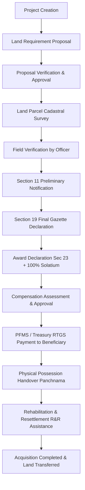
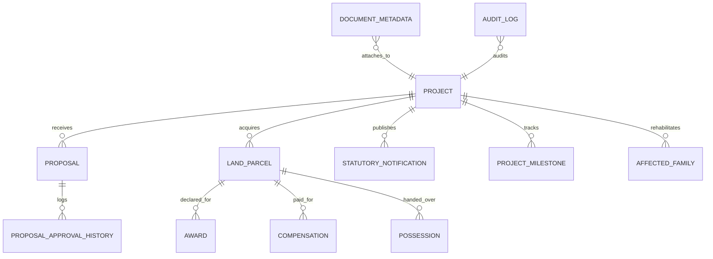

# National Land Acquisition & Management System (NLAMS) - Backend

Centralized backend system for digitizing the end-to-end statutory land acquisition and management lifecycle in India under the **RFCTLARR Act (Right to Fair Compensation and Transparency in Land Acquisition, Rehabilitation and Resettlement Act, 2013)**.

---

## 🏛️ System Architecture

Built as a high-performance **modular monolith** using Java 17, Spring Boot, Spring Data JPA, Hibernate, PostGIS/JTS GeoJSON, and OpenAPI Swagger documentation.

```
backend/
└── src/main/java/com/nla/
    ├── project/          # Infrastructure project lifecycle & metadata
    ├── proposal/         # Land requirement proposals & multi-tier approvals
    ├── land/             # Cadastral parcels, survey/khasra numbers & verification
    ├── gis/              # PostGIS / GeoJSON mapping & spatial boundaries
    ├── notification/     # Statutory preliminary (Sec 11) & final (Sec 19) gazette notices
    ├── award/            # Statutory award determinations, solatium (100%), and market values
    ├── compensation/     # Assessment, treasury approval, and RTGS/NEFT payment disbursement
    ├── possession/       # Physical possession handover, panchnama & inspection logs
    ├── rehabilitation/   # Affected/displaced families R&R assistance & resettlement
    ├── workflow/         # Lifecycle milestone pipeline and automated delay tracking
    ├── document/         # Secure file storage + metadata tracking
    ├── dashboard/        # Aggregated National, State, District, and Project analytics KPIs
    ├── report/           # State, district, financial, and bottleneck reports
    ├── audit/            # Immutable append-only audit trail
    └── common/           # Response wrapper, global exception handling, OpenAPI & security
```

---

## 🔄 End-to-End Statutory Acquisition Workflow



---

## 📊 Entity Relationship Diagram (ERD)



---

## 🚀 Quick Start (Local Run - Zero External Setup Required)

The project includes an in-memory database profile (`dev`) pre-configured with realistic Indian sample data (DMIC Manesar, NH-48 Expressway, Western DFC) so you can run and test everything immediately without installing PostgreSQL.

### 1. Run Backend Server:
```powershell
.\mvnw.cmd spring-boot:run
```

### 2. Open Swagger UI in Browser:
👉 **[http://localhost:8080/swagger-ui.html](http://localhost:8080/swagger-ui.html)**

### 3. Run Automated Tests:
```powershell
.\mvnw.cmd test
```
*(All 12 automated unit and end-to-end integration tests execute against the complete statutory acquisition lifecycle).*

---

## 🌐 Deploying to Render

Render is pre-configured with the included `Dockerfile` and `render.yaml`.

### Step 1: Push Code to GitHub
1. Create a repository on GitHub (e.g. `nlams-backend`).
2. Push your code:
   ```bash
   git add .
   git commit -m "Complete NLAMS backend with 14 modules and PostGIS support"
   git remote add origin https://github.com/<your-username>/nlams-backend.git
   git push -u origin main
   ```

### Step 2: Create PostgreSQL on Render
1. Go to [dashboard.render.com](https://dashboard.render.com) -> **New** -> **PostgreSQL**.
2. Name: `nlams-db`.
3. In the Render PostgreSQL dashboard, open the **Connect** tab -> **psql** and run:
   ```sql
   CREATE EXTENSION IF NOT EXISTS postgis;
   ```
4. Copy the **Internal Database URL** (or External URL).

### Step 3: Deploy Web Service on Render
1. On Render dashboard: **New** -> **Web Service** -> Connect your GitHub repo.
2. Runtime: **Docker** (Render will automatically detect the provided [Dockerfile](file:///c:/Project/land/Dockerfile)).
3. Under **Environment Variables**, add:
   * `SPRING_PROFILES_ACTIVE` = `postgres`
   * `DB_HOST` = `<Your Render Postgres Host>`
   * `DB_PORT` = `5432`
   * `DB_NAME` = `<Your Database Name>`
   * `DB_USER` = `<Your Database User>`
   * `DB_PASSWORD` = `<Your Database Password>`
4. Click **Create Web Service**. Your API and Swagger UI will be live!

---

## 🐳 Docker & Docker Compose

To run PostgreSQL + PostGIS and the Spring Boot application together locally with Docker:
```bash
docker-compose up --build -d
```
* **Backend API**: `http://localhost:8080`
* **Swagger UI**: `http://localhost:8080/swagger-ui.html`
* **PostgreSQL / PostGIS**: `localhost:5432` (DB: `nlams_db`, User: `postgres`, Pass: `postgrespassword`)

---

## 📋 Complete REST API Inventory

### 1. Projects (`/api/projects`)
* `POST   /api/projects` — Register new infrastructure project
* `GET    /api/projects` — Filter by state, district, status, projectType
* `GET    /api/projects/{id}` — Get project by ID
* `PUT    /api/projects/{id}` — Update project metadata
* `PATCH  /api/projects/{id}/status` — Transition lifecycle status
* `DELETE /api/projects/{id}` — Delete project

### 2. Proposals (`/api/proposals`)
* `POST   /api/proposals` — Create proposal draft
* `GET    /api/proposals` — List proposals with filters
* `GET    /api/proposals/{id}` — Get proposal details
* `PUT    /api/proposals/{id}` — Update proposal (allowed in DRAFT/RETURNED)
* `POST   /api/proposals/{id}/submit` — Submit for administrative review
* `POST   /api/proposals/{id}/approve` — District/State committee approval
* `POST   /api/proposals/{id}/reject` — Reject proposal
* `POST   /api/proposals/{id}/return` — Return for correction
* `GET    /api/proposals/{id}/history` — Multi-tier approval audit trail

### 3. Land Parcels (`/api/land-parcels`)
* `POST   /api/land-parcels` — Register land parcel with survey/khasra numbers
* `GET    /api/land-parcels` — Query parcels by project, district, status, village
* `GET    /api/land-parcels/{id}` — Get parcel details
* `PUT    /api/land-parcels/{id}` — Update cadastral details
* `PATCH  /api/land-parcels/{id}/status` — Update acquisition status
* `PATCH  /api/land-parcels/{id}/verify` — Record field verification
* `DELETE /api/land-parcels/{id}` — Delete parcel

### 4. GIS & Spatial Mapping (`/api/gis`)
* `GET    /api/gis/projects/{projectId}/parcels` — GeoJSON FeatureCollection of parcel polygons for map rendering
* `GET    /api/gis/projects/{projectId}/summary` — Acquired vs Pending area breakdown & geometry collection
* `GET    /api/gis/parcels/district?district=...` — All parcel polygons within a district
* `GET    /api/gis/parcels/nearby?lat=...&lng=...&radiusKm=...` — Spatial radius query around coordinates

### 5. Statutory Notifications (`/api/notifications`)
* `POST   /api/notifications` — Publish Section 11/19 gazette notifications
* `GET    /api/notifications` — Filter notifications by project, type, status
* `GET    /api/notifications/{id}` — Get notification
* `PUT    /api/notifications/{id}` — Update notification details
* `DELETE /api/notifications/{id}` — Delete notification

### 6. Awards (`/api/awards`)
* `POST   /api/awards` — Declare statutory award with 100% solatium & market value
* `GET    /api/awards` — Filter awards by project, parcel, status
* `GET    /api/awards/{id}` — Get award determination details
* `PUT    /api/awards/{id}` — Update award determination
* `DELETE /api/awards/{id}` — Delete award

### 7. Compensation (`/api/compensation`)
* `POST   /api/compensation` — Create compensation assessment record
* `GET    /api/compensation` — Filter compensation by project, parcel, status
* `GET    /api/compensation/{id}` — Get compensation details
* `PUT    /api/compensation/{id}` — Update compensation assessment
* `POST   /api/compensation/{id}/approve` — Approve for treasury disbursement
* `POST   /api/compensation/{id}/mark-paid` — Record payment & RTGS/NEFT transaction UTR reference
* `DELETE /api/compensation/{id}` — Delete compensation record

### 8. Physical Possession (`/api/possession`)
* `POST   /api/possession` — Schedule or take physical possession of parcel
* `GET    /api/possession` — Filter possession records
* `GET    /api/possession/{id}` — Get possession details
* `PATCH  /api/possession/{id}/status` — Mark possession TAKEN with panchnama
* `DELETE /api/possession/{id}` — Delete possession record

### 9. Rehabilitation & Resettlement (`/api/rr/families`)
* `POST   /api/rr/families` — Register affected or displaced family
* `GET    /api/rr/families` — Query families by project, category, status, district
* `GET    /api/rr/families/{id}` — Get family R&R details
* `PUT    /api/rr/families/{id}` — Update family details
* `PATCH  /api/rr/families/{id}/status` — Record assistance disbursement or resettlement site allotment
* `DELETE /api/rr/families/{id}` — Delete family record

### 10. Lifecycle Milestones & Delays (`/api/projects/{projectId}/milestones`)
* `GET    /api/projects/{projectId}/milestones` — Get timeline milestones with automated delay calculations
* `POST   /api/projects/{projectId}/milestones` — Add custom project milestone
* `POST   /api/projects/{projectId}/milestones/initialize-lifecycle` — Auto-generate standard 9-stage acquisition lifecycle pipeline
* `PUT    /api/projects/{projectId}/milestones/{milestoneId}` — Update planned/actual dates
* `DELETE /api/projects/{projectId}/milestones/{milestoneId}` — Delete milestone

### 11. Dashboards (`/api/dashboard`)
* `GET    /api/dashboard/national` — Country-level overview of projects, land, finance, R&R, delays
* `GET    /api/dashboard/project/{projectId}` — Project-level progress KPIs and parcel breakdown
* `GET    /api/dashboard/state/{stateName}` — State-level progress summary
* `GET    /api/dashboard/district/{districtName}` — District-level progress summary

### 12. Reports & Analytics (`/api/reports`)
* `GET    /api/reports/state-wise` — State-level acquisition & financial performance
* `GET    /api/reports/district-wise` — District-level performance
* `GET    /api/reports/project-wise` — Project status, land, finance, and delays
* `GET    /api/reports/compensation` — Beneficiary-level disbursement audit
* `GET    /api/reports/possession` — Physical possession status & officer records
* `GET    /api/reports/rr` — Affected/displaced family entitlements & status
* `GET    /api/reports/delays` — Projects facing milestone bottlenecks

### 13. Documents (`/api/documents`)
* `POST   /api/documents/upload` — Multipart file upload with metadata linkage
* `GET    /api/documents/{id}/metadata` — Document metadata
* `GET    /api/documents/{id}/download` — Binary file download
* `GET    /api/documents/entity/{entityType}/{entityId}` — Documents attached to an entity
* `DELETE /api/documents/{id}` — Delete document and file

### 14. Audit Trail (`/api/audit`)
* `GET    /api/audit` — Paginated global audit trail
* `GET    /api/audit/{entityName}/{entityId}` — Complete history of state transitions for any entity

---

## 🔒 Security & User Roles

Configured with Spring Security with support for role-based jurisdictions:
* `CENTRAL_AUTHORITY` — National monitoring and national project oversight
* `STATE_AUTHORITY` — State-level review and committee approvals
* `DISTRICT_AUTHORITY` — District Magistrate / Collector approvals and award declarations
* `PROJECT_AGENCY` — Project & proposal creation (NHAI, Railways, Metro, NICDC)
* `FIELD_OFFICER` — Cadastral survey verification and possession panchnama
* `RR_OFFICER` — Rehabilitation and resettlement entitlement management
* `ADMIN` — System administrator
